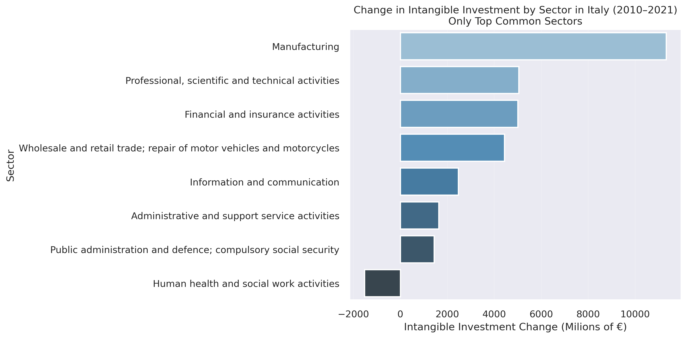
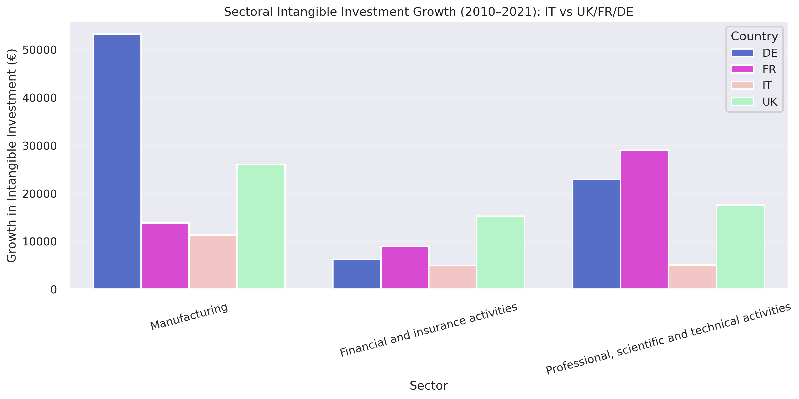
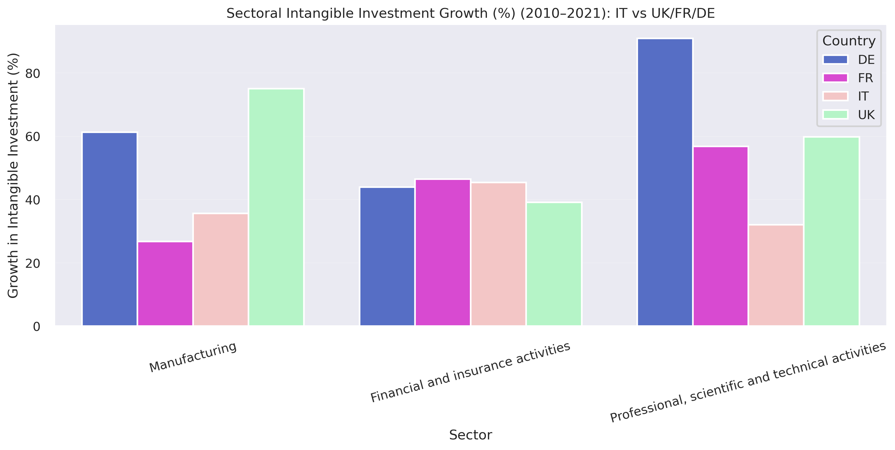
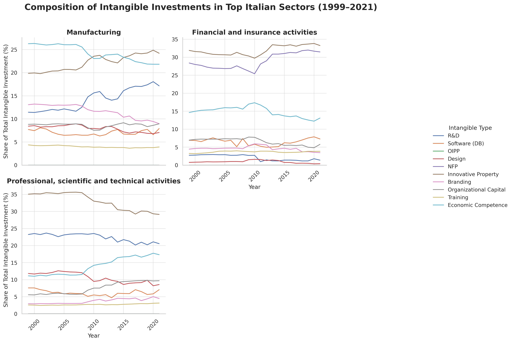

# Internet and Network Economics

### Research Q:
Italy’s intangible investment growth: patterns, sectors, and comparison with top EU performers (1999–2021).

### Introduction

To start the analysis, we should focus on the top countries first. To do that, we first examine the countries based on their total investments in intangibles.

1. We first checked that the countries that will be selected are in Europe. The list of European country codes is as follows:
    ```AT, IE, CZ, LV, RO, FI, BG, IT, MT, ES, SE, FR, DK, LT, NL, EE, SI, UK, HR, PL, SK, HU, LU, PT, EL, DE, CY, BE```

2. Then, we selected the countries for which we had enough data (Not selecting countries for which we do not have enough data). So, then the list would be this:
    ```AT, BG, CZ, DE, DK, EL, FI, FR, HU, IT, LV, NL, RO, SE, SK, UK```

3. We then plotted the total intangible and total tangible investments of these selected countries, set the base to 1999, and observed the chart below, which shows that the growth in intangible investment is more than the growth in tangibles.


4. We then plotted the total intangible and total tangible investments of Italy, set the base to 1999, and observed the chart below, which shows that the growth in intangible investment has been steady and it surpassed the investment growth of tangibles after 2009. But it is worth noting that the dip in 2020 may correspond to covid-19, and also Italy has put more investment in both tangible and intangible since then, but investment in intangibles were more significant.


5. Then, we of course converted the amount of investments of those countries that do not use the Euro to Euro based on the official data from ECB (European Central Bank), which was from 1999 onwards. So, because of that, we used the data from the year 1999.

6. Based on that, we charted investments in intangibles and also the ratio of intangible investment compared to total investment (intangibles + tangibles).


So, the top 5 countries based on the amount of intangible investments are: ```UK, DE, FR, IT, NL```
And the top 10 countries in terms of the ratio of intangible investment compared to total investments are: ```HU, EL, UK, SE, NL, FI, FR, DK, DE, IT```

Finding out that the top 5 countries are also the top 10 performers in the ratio of intangibles, we selected ```UK, DE, FR, IT, NL``` as the top 5 performers for further investigation.

### Step 0 – General Insights:
- Comparison of Italy vs EU and Top 5/X EU countries:
  - Trends in total intangible investment as a percentage of total (tangible + intangible) investments.
  

  - Trends in total intangible investment.
  
  As shown in the above chart, Italy has been investing more in Intangibles over the years. But from around the year 2010, the growth in investment rate of intangibles in the top 3 countries UK, France, and Germany, has been more than Italy, and Italy has been almost on par with the  Netherlands and Sweden in terms of growth in intangible investments.
  One finding worth mentioning is that Germany has been seriously investing more in intangibles since 2010 and has well passed France in that regard.

  The intersection of the top 10 sectors in which these 3 countries had the largest growth of intangible investment are as follows: ```Administrative and support service activities, Financial and insurance activities, Human health and social work activities, Information and communication, Manufacturing, Professional, scientific and technical activities, Public administration and defence; compulsory social security, Wholesale and retail trade; repair of motor vehicles and motorcycles```

  How these 3 countries, Italy and the Netherlands, performed in these sectors from an intangible investment perspective:
    | Country     | Average changes (%) | Average changes Millions of Euros |
    | ----------- | ------------------- | --------------------------------- |
    | UK          | 67.05               | 15005.62                          |
    | Germany     | 75.93               | 16015.60                          |
    | France      | 50.98               | 11801.07                          |
    | Italy       | 24.71               | 3728.33                           |
    | Netherlands | 63.17               | 4172.12                           |

    Italy has been lagging by not investing in those sectors, while the top 3 countries, of UK, Germany, and France, have been doing this since 2010. The Netherlands has significantly increased the ratio of investments in the mentioned sectors, but it was not a large amount.

### Step 1

Italy vs Top Performers

Italy’s intangible investment has grown steadily since 1999, but at a slower rate compared to the UK, Germany, and France. Despite Italy's absolute investment in intangible assets being sensibly lower than the top three performers, in terms of growth percentage, Italy has been investing in intangibles at almost the same steady rate as the others. 
However, if the investment growth remains the same, as shown in the graph below, it will be well behind the UK, France, and Germany, leading to reduced competitiveness in intangible-intensive sectors.


Italy vs EU Average

While Italy invests more in intangibles than most EU countries in absolute terms, its growth pace is slower than the EU average. Italy ranks as an upper-mid performer, demonstrating a solid structural commitment to intangible investment, but without the dynamic acceleration seen in the leading countries (UK, Germany, and France). This indicates that although Italy’s investment level is strong, its relative growth may not be sufficient to drive a leadership position in innovation over time.


Sectoral Drivers (2010–2021)

The 3 countries of the UK, Germany, and France outperformed Italy in this period in growing their intangible investments.
The graph displays the change in intangible investment by sector in Italy over the period 2010–2021, focusing only on the top common sectors.

    
Each bar represents the net change in intangible investment (measured in millions of euros) for a given sector.
- Manufacturing shows by far the largest increase, indicating a substantial growth in intangible asset investments over the period.
- Professional, scientific and technical activities, Financial and insurance activities, and Wholesale and retail trade sectors also show significant increases, though much smaller compared to manufacturing.
- Interestingly, Human health and social work activities recorded a negative change, suggesting a decline in intangible investments between 2010 and 2021.
The chart emphasizes the sectoral disparities in intangible investment evolution, with some industries investing heavily while others stagnating or declining.

Sectoral changes for IT vs UK/FR/DE.

Visualize the top sector changes for IT vs UK/FR/DE to show divergence



The first graph shows the absolute growth of intangible investment by sector and country between 2010 and 2021. Germany dominates manufacturing investment growth, while the UK leads in professional and technical services. Italy shows positive, but more modest, growth across all three sectors.
However, absolute values alone may be misleading, as they reflect both growth and initial investment size.
    To better capture the dynamics, the second graph reports sectoral growth in percentage terms. This reveals that although Italy has lower absolute increases, in the Financial and Insurance activity sector, it has achieved comparable or even stronger percentage growth relative to its starting point.
Overall, Italy’s intangible investment expansion appears balanced across sectors, but remains smaller in scale compared to the leaders, especially in innovation-intensive industries like professional services.

CAGR calculation for total intangible investment from 2010 to 2021

Calculate and show the compound annual growth rate (CAGR) for total intangible investment in each country (2010–2021) to quantify the lag.
    
  | Country | GACR 2010-2021 |
  | ------- | -------------- |
  | IT      | 2.19%          |
  | UK      | 4.66%          |
  | FR      | 3.59%          |
  | DE      | 4.96%          |
      

The CAGR tells you how much, on average, each year, the investment has grown, taking into account compound growth, so considering that each year the value grows from that of the previous year.
    From the previous graphs, we see that, in terms of absolute and total percentage growth 2010-2021, Italy has experienced positive expansion of investment in intangibles, although lower than the UK, France, and Germany in several areas.
    However, the CAGR graph shows another dimension: the average annual growth of investment in Italy was significantly lower (about 2.2 percent) than in other countries, particularly Germany (about 5 percent) and the UK (about 4.6 percent).
    This indicates that Italy has been investing, but at a slower and less steady pace over time, while the UK and Germany have maintained more robust and sustained growth year after year.


    In the manufacturing sector, there has been a significant growth in R&D as a percentage of total intangible investment since around 2015. Economic Competence and Innovative Property remain high, while investments in Software and Design are stable but less significant. In the financial and insurance activities sector, Innovative Property and Economic Competence dominate with high and stable shares. R&D has a marginal weight compared to other sectors, and there is a concentration on a few types of intangibles. In the professional, scientific, and technical activities sector, Innovative Property has a dominant but decreasing weight, while R&D has a constant share. Overall, the trends in intangible investment composition differ across these sectors in Italy.


In the manufacturing sector, there has been significant growth in R&D (Research and Development) investment since 2015, with a visible increase also for Economic Competence and Innovative Property, which remain among the major components.  Overall, the sector shows a strong focus on creating and protecting innovation. 

In the Professional, Scientific and Technical Activities sector, Innovative Property dominates intangible investment, although a slight decline in its relative share is noted in recent years. Investment in R&D appears to be constant over time, while there is a gradual growth in investment in Economic Skills and Organizational Capital. This suggests an evolving sector geared toward both knowledge enhancement and internal skills strengthening.

For the financial and insurance activities sector, we can see that innovative property and NFP investments assume particular importance, following a linear but very pronounced growth since 2010. investments in software are also significant in this sector. 

### Conclusion
Conclusion here

### Future works

Future works here
